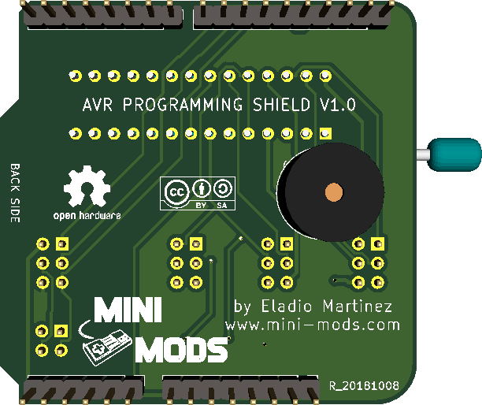

# Arduino Shield AVR Programmer

The Arduino software comes with an ArduinoISP sketch which allows an Arduino, correctly connected, to flash another AVR chip. With the use of other libraries like Attiny-core, this means you can use your Arduino and it’s IDE to program Attiny chips! This shield takes all the hassle out of connecting the wires, and with the simple use of a jumper cable, lets you program 8, 14, 20, and 28-pin chips with one easy-to-use zero insertion force (ZIF) socket!

- Load a bootloader on an Atmega328 as a replacement or for a breadboard project.
- Load a program on an Attiny 84, 85, or 2313 using the Arduino IDE.
- Update a program on any AVR project that has an ISP header.

License
-------

 

This project is open hardware licensed under the Attribution-ShareAlike 4.0 (CC BY-SA 4.0) license. The full legal text of the license may be found in the LICENSE.md file in this repository. For more information about this license, please visit 
the Creative Commons Foundation (https://creativecommons.org/licenses/by-sa/4.0/).

Features:
-------

- Reprogram a chip in an existing circuit with an ISP header.
- Simple and easy jumper system allows programming 8, 14, 20, and 28 pin chips using a single socket.
- LEDs give the status of the programmer.
- Support for a piezo beeper for error/success audible tones.
- An indicator light on pin D3 lets you run “BLINK” on any of the chips while it is in the socket.
- Compatible with ArduinoISP, AdafruitISP, and AdaLoader.
- Tested on Duemilanove, Uno, and Mega (requires jumpers).
- Use an IDC 6 Pin Ribbon Cable to connect the ISP port to the desired IC pinout.

----------
Front Side:

----------
Back Side:

----------

Project
-------

The PCB design was originally developed in Kicad.

# Contribution

## Suggestions and Bugs in Hardware

You should report bugs or suggestions via [Issues area](https://github.com/mafe72/Arduino-Shield-AVR-Programmer/issues) here in github.

Make sure you meet the following criteria when creating / submitting your issue:

- Use a clear and descriptive title to identify the problem / suggestion.
- Describe the exact steps to reproduce the problem in as much detail as possible.
- Mention where this problem was found / what your suggestion will affect.

## Contribution to hardware improvements

Community contributions are always welcome!

This section is intended to help anyone interested in contributing to this repository.
Before you contribute, first get approval from the repository and community maintainers by raising a problem from GitHub using the guidelines mentioned in the suggestions section.
 
Once you get approved, you will need to do the following steps (these instructions assume that you are a GitHub user).

- 1: fork this repository.
- 2: Make changes, commit and push to the fork.
- 3: Submit your Pull Request.

## If you have any questions please contact me

info@attinyuino.com
